class: center, middle

# The Currents of Concurrency
## Reasoning with Async Rust
## Zainab Ali
https://zainab-ali.github.io/reasoning-with-async-rust

???

When we write Rust, particularly Async Rust, we get bogged down by details.

There's a lot of new syntax to pay attention to.
And when we get into the weeds of writing code,
we encounter confusing error messages,
and solving problems,
we can sometimes forget about the problems we're solving.

In this talk, I want to present a high level, mental picture about what Async Rust is and how we can think about problems with it.

I'm Zainab, I'm a functional programmer and trainer, and I'm particularly interested in how we think about concurrency.

---
class: center, middle

# Why async?

???

The aim of async Rust is to describe programs where things happen "at the same time".

Most code we write is sequential. But sometimes it's not. 

For instance, when writing a webservice you want to serve many requests "at the same time". And also read from a file or write to a database.

If you're writing a game engine, you're rendering at the same time as receiving user input.

---
class: center, middle

# Concurrency

???

This is known as the problem of concurrency. It's not new by any means, and nor is it unique to Rust.

In fact, each language ends up needing to do this, and they each do it differently:
 - C works with threads (OS level)
 - Go has goroutines
 - Erlang has actors
 - JS ecosystem has futures and promises.
 - Scala / FP has effect systems

You may well wonder - why?

Why are there so many different solutions to the same problem?

---
class: center, middle

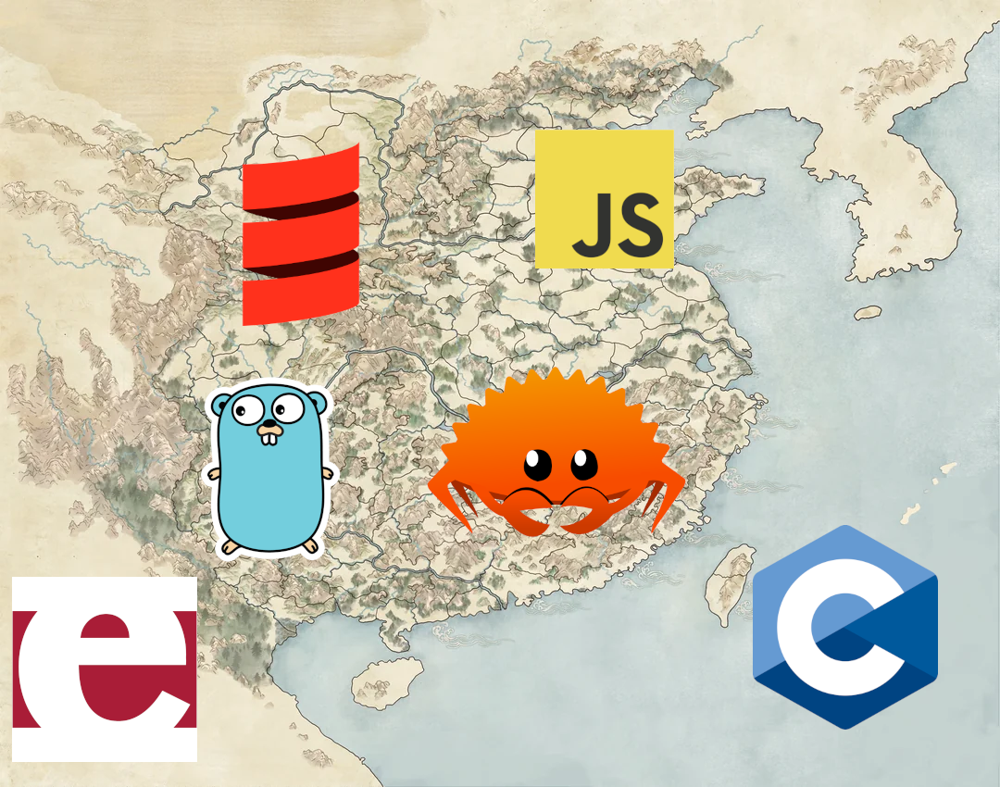

???

You can think each language as each having their own unique terrain that shapes it; it's own constraints and features. Some of them have runtimes, garbage collection, and pay a price for that.

Each language has its own ideas on how to tackle concurrency, and the wonderful thing about ideas is that they migrate. In forming async Rust, ideas migrated from many different places.

And they are migrating back. Async Rust has had a strong influence on other languages and ecosystems.

Incidentally, people also migrate, which is why async Rust can be challenging. Depending on where you're coming from, your view is very different.

If you come from Scala or Go, you probably find things familiar, but wonder why it's so hard to express things? If you're coming from C, you everything might seem alien.

We're going to learn about Async Rust. Along the way, we'll learn a bit about the flavours of concurrency in other langauges and see how they shaped it.

But first, we need a problem to solve.

TIME: 3 minutes

NOTE: Miss out paradigms are another axis, Each language has differnt constraints, whether it has a runtime or not, how it's memory management is done, what it's type system is suited for.

---
class: center, middle
# Concepts
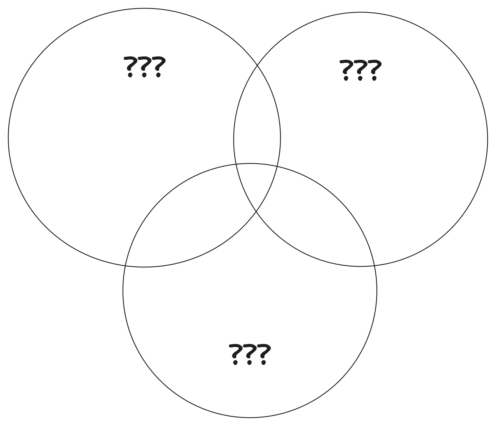

---
class: center, middle

# An example: this slideshow

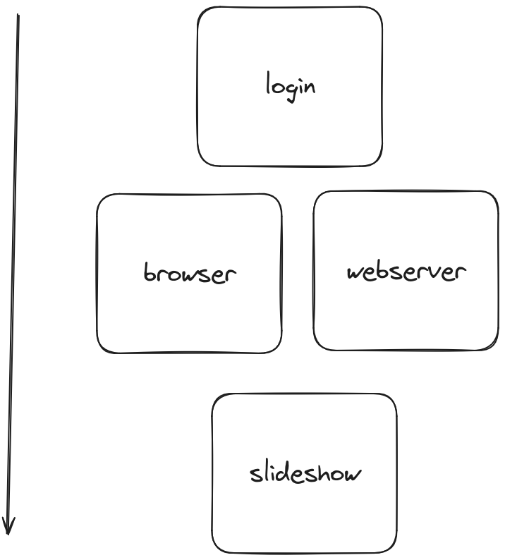

???

As an example. Let's use the tasks required for me to give this slideshow.

 - First I need to log in as my user. Open a session.
 - I need to open a browser.
 - I need to start a webserver.
 - Finally I need to present my slideshow.

Because the word "task" is taken, I'm going to call these things units.

We'll see how they relate to async along the way.

The most interesting units here are browser and my webserver. I want to start these concurrently.

By concurrently, I mean independently.
Concurrency implies independence.

NOTE: We want to define dependencies, we don't really govern execution.

---
class: aim-start-a-graph
# Aim: Start a graph of units

 - Start the slideshow graph.
 - Start an arbitrary graph.

???

We're going to model a fixed set of units - we're going to hardcode the graph I've shown you.

We're then going to model a general graph.

Finally, we share state, and how not to.

All the while, we're going to pay attention to our view of concurrency.

---
## Basic Rust

```rust
fn main() {
    start("login");
    start("browser");
    start("webserver");
    start("slideshow");
}
```

```rust
fn start(name: String) {
    println!("Starting {}", name);
    sleep(one_second);
    println!("Running {}", name);
}
```

???

That's all a bit abstract, so to get down to concretes, let's first look at this problem in standard Rust.
We're not using any async programming here.

 - We have a main program which starts login, then browser, then my webserver, and then finally my slideshow.
 - We've mocked their startup. To remove some of the complexity. We're just going to print to the console before and after they've started, and we're mocking their startup by sleeping.
 
NOTE: I've simplified the code to remove clone calls.
 
---
class: output
## The output

```sh
Starting login
Running login
Starting browser
Running browser
Starting webserver
Running webserver
Starting slideshow
Running slideshow
```

???

If we run this, we get this output. Note that it's sequential, if I were to demo this, you'd see that there was a one second delay between the starting and the started.


---

class: async

# Async

```rust
#[async_std::main]
async fn main() {
    start("login").await;
    start("browser").await;
    start("webserver").await;
    start("slideshow").await;
}
```

```rust
async fn start(name: String) {
    println!("Starting {}", name);
    Delay::new(one_second).await;
    println!("Running {}", name);
}
```

???

That's the sequential code. What about async?

The code looks very similar.

The biggest thing we've done is introduced this async keyword before main and start.

We've also written this extra await after each call to start.

And we've replaced our sleep with Delay, from futures_timer.

And we have this async_std main macro. Which we're going to ignore for the moment.

---
class: output

# The output

```sh
Starting login
Running login
Starting browser
Running browser
Starting webserver
Running webserver
Starting slideshow
Running slideshow
```

???

And you might think that with this async / await syntax, we'd have different output.

But our output is exactly the same.

Aside from making our code more verbose, what have we actually done?

---
class: center, middle
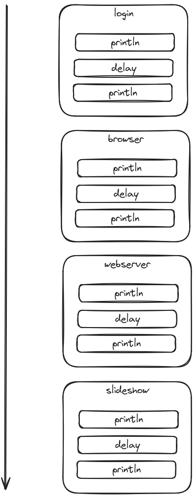

???
You can think of the async keyword as introducing the idea of units of work.
await as defining a sequential dependency between these units.

---
class: join
# join!

```rust
    start("browser").await;
    start("webserver").await;
```
```rust
    join!(start("browser"), start("webserver"));
```

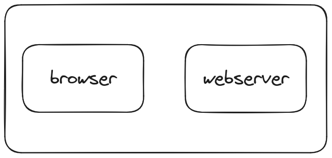

???

But we didn't want a sequential dependency. 

We started using async in the first place to run units concurrently.

We can express that using the join macro.

join is arguably more important than async and await here. Because it lets us express this concurrent relationship.

If we join these two units, they can happen in any order. 

---
class: concurrency-join

# Concurrency

```rust
async fn main() {
    start("login").await;
    join!(start("browser"), start("webserver"));
    start("slideshow").await;
}
```

```sh
Starting login
Running login
Starting browser
Starting webserver
Running browser
Running webserver
Starting slideshow
Running slideshow
```

???

So here's how we incorporate join. We can express both sequential and concurrent units.

If you look at the output now, we start both the browser and webserver at the same time.

---
class: center, middle
# Concepts

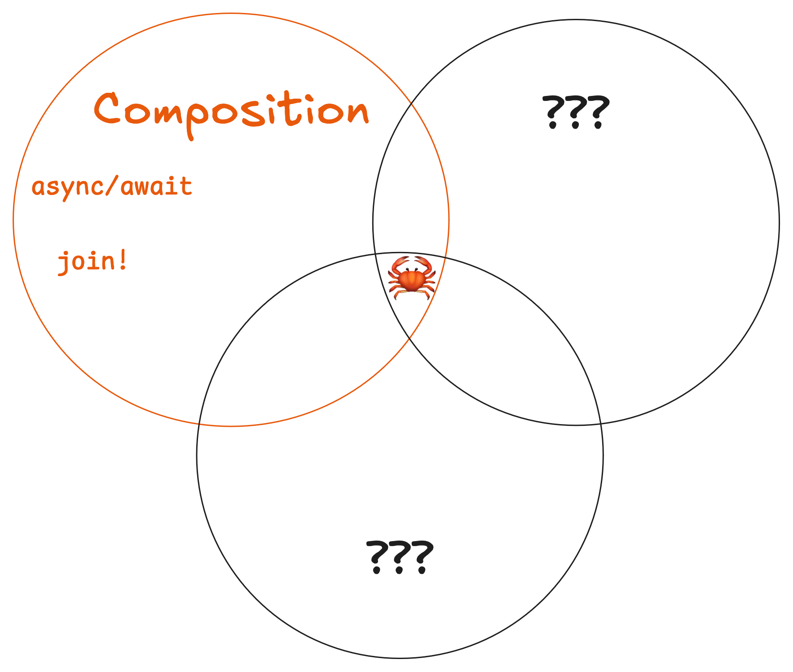

???

TIME: 4 minutes

NOTE: Not talked about how they are run.

---
class: center, middle

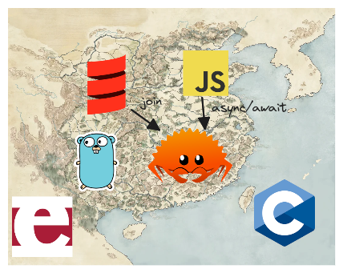

???

You might think these look rather alien, or maybe they're familiar to you. 

That's because they came from elsewhere.

async / await probably came from javascript.
join came from Scala.

By the way: tracking the movement of ideas is very hard. If you think there are other languages, or if things came differently. I'll very happily accept corrections.

---

class: aim-start-a-graph
# Aim: Start a graph of units

 - Start the slideshow graph. 🦀
   - Use `async`, `await` and `join`.
   - Compose units of work.
 - Start an arbitrary graph.
   - Model the graph as data. 🛠

---

```rust
struct UnitDef {
    name: String,
    dependencies: Vec<String>,
}

```

```rust
async fn start_graph(units: Vec<UnitDef>, name: String) -> ()
```

---

```rust
    let units = [
        UnitDef {
            name: "login",
            dependencies: vec![],
        },
        UnitDef {
            name: "browser",
            dependencies: vec!["login"],
        },
        UnitDef {
            name: "webserver",
            dependencies: vec!["login"],
        },
        UnitDef {
            name: "slideshow",
            dependencies: vec!["browser", "webserver"],
        },
    ];

```
```rust
start_graph(units, "slideshow").await;
```

???

So far we've defined a fixed graph.
But it would be nice to be able to describe an arbitrary graph, provided it was valid.

I'm going to do this by describing my graph as a data structure. 

I'll create this UnitDef struct to represent a unit definition.
And a graph is just a vector of unit definitions.

Finally, I'm going to have a function start_graph that starts a unit and all its dependencies.

---
class: center, middle

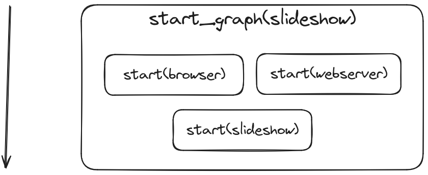

???

If we think about what that function should look like for slideshow
---

# Arbitrary graph

```rust
async fn start_graph(units: Vec<UnitDef>, name: String) {
    let unit = find_unit(units, name);
    unit.dependencies
	    .iter().for_each(|dep| {
            unimplemented!("start dependency");
    });
    start(unit.name).await;
}
```

???

This start_graph function takes a vector of all the units and the name of the unit to start.

It first looks up the unit, let's assume it always exists.
It starts its dependencies.

And then it starts the unit itself.


But actually, starting these dependencies is a bit confusing. 
When we start these dependencies, do we want to start them sequentially or concurrently?

We can try and use await, our compiler is unhappy and besides this isn't what we mean anyway. 

---
class: center, middle

# What is `async`?

???

To resolve this, we need to look a little deeper into what Async really is.

So far we've seen the syntax and seen how it can express dependecies. 

But I haven't gone into any detail about how it's done.  Ignoring the how makes it easy to first grasp, but without that understanding it becomes difficult to compose units in more complex ways.

And to those of you familiar with the ways of Rust, you might feel a bit betrayed by that. 
I've sort of waved my magic wand and said that async just happens, but Rust has very little by way of sorcery.

So let's remove some of the mystery and have a look at the async / await keywords in a bit more depth.

---

# Syntax

```rust
async fn start(name: String) {
    println!("Starting {}", name);
    Delay::new(one_second).await;
    println!("Running {}", name);
}
```

```rust
fn start(name: String) -> impl Future<Output = ()> {
    lazy(|_| println!("Starting {}", name))
        .then(|_| Delay::new(one_second))
        .then(|_| lazy(|_| println!("Running {}", name)))
}
```

???

This is our async start function. It prints, delays and prints again.

Let's remove the async / await keywords and use std Rust instead.

We can replace async / await with something called a future.

Instead of our start function being async, we're returning this impl Future.

It's first created by this call to `ready`. And instead of `async`, we're using `then`.

So this is a bit more verbose, but it should demystify a few things.

Future is a trait, and we're returning an implementation of this trait. An impl means the compiler knows exactly what this is, we're asking the compiler to come up with a name for it.

The type Output is what the future returns, in our case unit.

So that makes things a bit less abstract. These units we're constructing are implementations of future. They're structs and hence data.

We can manipulate them as such. 

---
# Arbitrary graph

```rust
async fn start_graph(units: Vec<UnitDef>, name: String) {
    let unit = find_unit(units, name);
    let start_deps = unit.dependencies.iter().map(|dep| {
	    start(dep)
    });
	join_all(start_deps).await;
    start(unit.name).await;
}
```

???

Going back to our problem, we want to start all dependencies at the same time. 
Let's build a collection of futures and iterate over them. We just need to figure out how to join a collection of futures, and we can do that with the `join_all` function.

---
class: center, middle
# Concepts

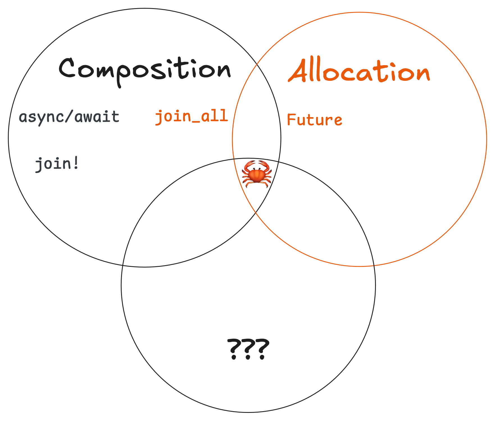


---
class: aim-start-a-graph
# Aim: Start a graph of units

 - Start the slideshow graph. 🦀
   - Use `async`, `await` and `join`.
   - Compose units of work.
 - Start an arbitrary graph. 🦀
   - Units are implementations of future.
   - Futures are datastructures.

???

Have we actually?

---
class: output
# The output

```sh
Starting browser
Starting webserver
Running browser
Running webserver
Starting slideshow
Running slideshow
```

???

Can anyone see the problem?

What happened to login?

I didn't miss it out in my list of units

---

# Dependencies of dependencies

```rust
async fn start_graph(units: Vec<UnitDef>, name: String) {
    let unit = find_unit(units, name);
    let start_deps = unit.dependencies.iter().map(|dep| {
	    start(dep) // <- start their dependencies too
    });
	join_all(start_deps).await;
    start(unit.name).await;
}
```

???

We're not starting the dependencies of our dependencies.

There's an easy way to do that.

---

# Recursion

```rust
async fn start_graph(units: Vec<UnitDef>, name: String) {
    let unit = find_unit(units, name);
    let start_deps = unit.dependencies.iter().map(|dep| {
	    start_graph(units, dep)
    });
	join_all(start_deps).await;
    start(unit.name).await;
}
```
---

```sh
// 27 | async fn start_graph(units: Vec<UnitDef>, 
//                 name: String) {
// |             ^ recursive `async fn`
// |
// = note: a recursive `async fn` must be rewritten to
//         return a boxed `dyn Future`
// = note: consider using the `async_recursion` crate:
//         https://crates.io/crates/async_recursion
```

???

If we try and recurse - call start_graph within itself, the compiler nudges us.

note: a recursive `async fn` must be rewritten to return a boxed `dyn Future`

It's also giving us a helpful suggestion of using async_recursion, which we'll get to.

But first, what is a boxed dyn future? What have we done wrong here?
---

# Structs and sizes

```rust
async fn start_graph(units: Vec<UnitDef>, name: String) { }
```

```rust
fn start_graph(units: Vec<UnitDef>, 
               name: String) -> impl Future<...> { }
```
???

Let's think about what we're asking the compiler to do when we write async.

async is just a shorthand for returning an implementation of Future.

When we use it, we're asking the compiler to synthesize a struct for us. 
That struct must contain everything the unit of work needs to run. 

And in order for it to be created, it must have a fixed size.

---

class: center, middle
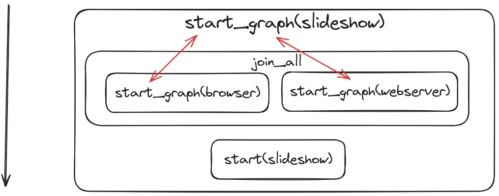

???

But in writing a recursive function, we're doing something similar to creating a recursive data structure.

And so we run into all the same issues as we would recursive data structures. If you remember how to create a linked list, if you haven't yet, please try. It's a fun exercise. You'll remember that you need to box things. 

Boxes reference data on the heap, and being pointers are always a fixed size.

So by boxing the future, we can construct something of a fixed size that the compiler can work with.

You might wonder: why didn't we need to box the futures when working with our dynamic vector of dependencies.

In fact, we did, but join_all handles that for us.
---

# Boxing

```rust
fn start_graph(units: Vec<UnitDef>, 
               name: String) -> impl Future<...> { }
```

```rust
fn start_graph(units: Vec<UnitDef>, 
               name: String) -> Box<dyn Future<...>> { }
```

```rust
fn start_graph(units: Vec<UnitDef>, 
               name: String
			   ) -> Box<dyn Future<Output = ()>> {
    Box::new(async {
        let unit = find_unit(units, name);
        let start_deps = unit.dependencies
            .iter()
            .map(|dep| start_graph(units, dep));
        join_all(start_deps).await;
        start(unit.name).await;
    })
}
```

???
We can move our code into an async block, which is a bit similar to a function, and wrapping that block in a box.

But if we do that, we get a different more confusing error message.

---

# Pinning

```sh
 | join_all(deps).await;
 |  -^^^^^^ the trait `Unpin` is not implemented for
 | `dyn futures::Future<Output = ()>`
```

???

Implementations of future are just structs.
But some of them can be special. In particular they contain references to themselves. They're known as self-referential structs.

And they point to their own memory.

The problem with pointing to their own memory, is that they can't be moved in memory without invalidating their own data.

Most rust code assumes we can move things around in memory as much as we like. But most of the time, we can't do that with Futures. So we need some way of telling the compiler not to move this thing we've created.

We do that through pinning. Pinning tells the compiler that the struct shouldn't be moved in memory. The compiler will take care not to do so.

---

# Pinning

```rust
fn start_graph(units: Vec<UnitDef>, 
               name: String
			   ) -> Pin<Box<dyn Future<Output = ()>>> {
    Box::pin(async {
        let unit = find_unit(units, name);
        let start_deps = unit.dependencies.iter()
		   .map(|dep| start_graph(units, dep));
        join_all(start_deps).await;
        start(unit.name).await;
    })
}
```

---

# Async recursion

```rust
#[async_recursion]
async fn start_graph(units: Vec<UnitDef>, name: String) {
    let unit = find_unit(units, name);
    let start_deps = unit.dependencies.iter()
	  .map(|dep| start_graph(units, dep));
    join_all(start_deps).await;
    start(unit.name).await;
}
```

???

We construct a pin of a box with `Box::pin`.

But we could have also used this async recursion macro.

---
class: center, middle
# Concepts

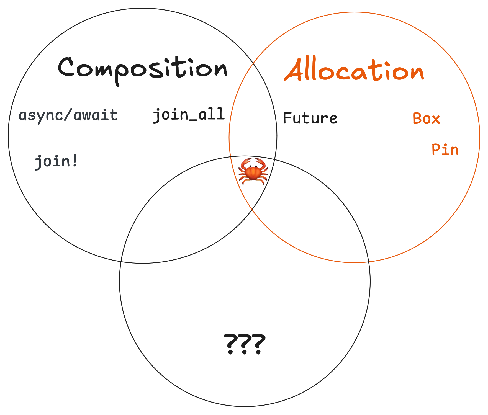

---
class: center, middle


???

Boxing and pinning is unique to Rust. It's its own view of memory management.

---
class: aim-start-a-graph
# Aim: Start a graph of units

 - Start the slideshow graph. 🦀
   - Use `async`, `await` and `join`.
   - Compose units of work.
 - Start an arbitrary graph. 🦀
   - Units are implementations of future.
   - Futures are datastructures.
   - `Box` to put them on the heap.
   - `Pin` to prevent them moving in memory.

???

Or have we?

---
class: output login-twice
# The output

```sh
Starting login
Starting login
Running login
Starting browser
Running login
Starting webserver
Running browser
Running webserver
Starting slideshow
Running slideshow
```

---

# Mutable state

```rust
#[async_recursion]
async fn start_graph(units: Vec<UnitDef>, 
    started_units: &mut Vec<String>,
	name: String) {
    if !started_units.contains(&name) {
        let unit = find_unit(units, name);
        let start_deps = unit
            .dependencies
			.iter()
            .map(|dep| start_graph(units, 
			                       started_units,
								   dep));
        join_all(start_deps).await;
        start(unit.name).await;
        started_units.push(name);
    }
}
```
---

```sh
// error: captured variable cannot escape `FnMut` closure
//    |   body
//    |         inferred to be a `FnMut` closure
```

???

This time it's the borrow checker.

This is correct. If we access the same mutable state, we end up with data races among other things.

This doesn't really have much to do with concurrency. We can't have two mutable references in the same scope.

It just so happens that when writing async code, we tend to want to do that.

---
class: center, middle

# The warring states

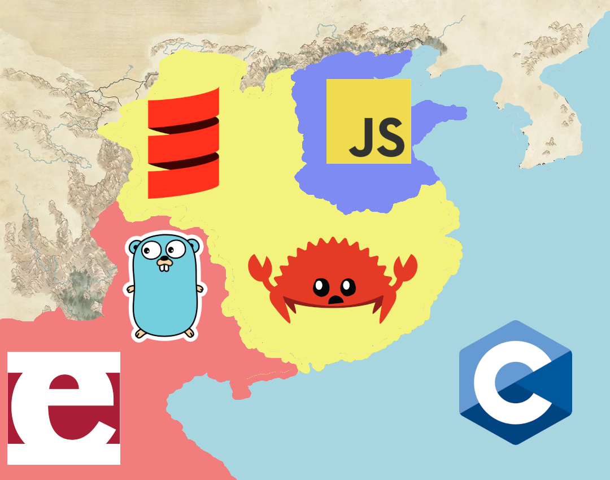

???

There are two factions when it comes to managing shared state.

On the one side:
 - Share state, but with locks.
On the other:
 - We don't
 
JS is single threaded, but you can make and use mutexes.

The fact that neither side has won means that they probably both have their merits.

Rust is in neutral territory - we can do both.

---
class: center, middle

# Shared state
## Mutex
???

Mutable references won't work. We can't use them because they'll lead into data races.

So what can we use?

The all powerful construct for dealing with concurrent mutable state is a mutex.

There's only one thing you do with a mutex.

---
class: center, middle
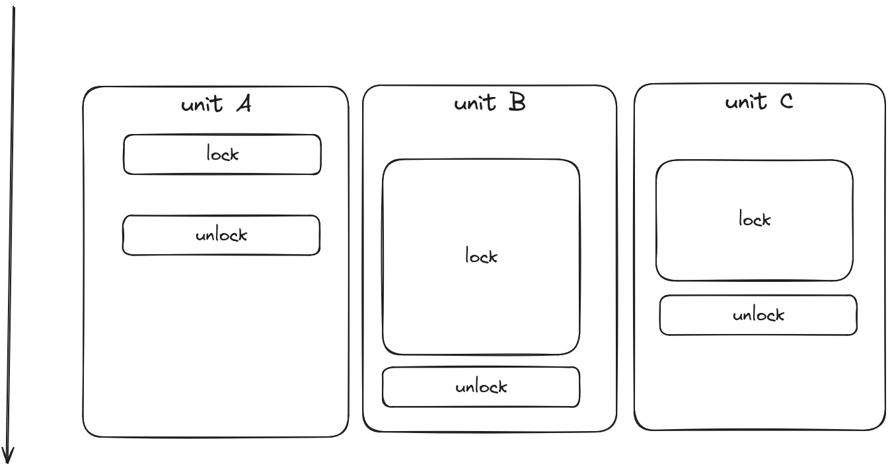

???

A mutex is a construct that wraps the state you want to share.

And to actually access that state, you need to lock it.

Unfortunately because of the nature of how you use mutexes, the borrow checker isn't able to detect when a mutex should be dropped.

So you need to count references at runtime with something known as an atomic reference counter.

Instead of tracking our references at compile time with the borrow checker, we're tracking them at runtime with an Arc.
---

# Shared state

```rust
async fn start_graph(units: Vec<UnitDef>, 
                     mut_started_units: Arc<Mutex<Vec<String>>>, 
					 name: String) {
    let mut started_units = mut_started_units.lock().await;

    if !started_units.contains(&name) {
	    let unit = find_unit(units, name);
        let start_deps = unit.dependencies.iter()
		  .map(|dep| start_graph(units, dep));
        join_all(start_deps).await;
        start(unit.name).await;
        started_units.push(name);
    }
}
```

---

# Output

```sh


```
---
# Shared state

```rust
async fn start_graph(units: Vec<UnitDef>, 
                     mut_started_units: Arc<Mutex<Vec<String>>>, 
					 name: String) {
    println!("About to acquire lock for {}", name);
    let mut started_units = mut_started_units.lock().await;
    println!("Acquired lock for {}", name);
    ...
}
```

```sh
About to acquire lock for slideshow
Acquired lock for slideshow
About to acquire lock for browser
About to acquire lock for webserver
```

---
class: center, middle

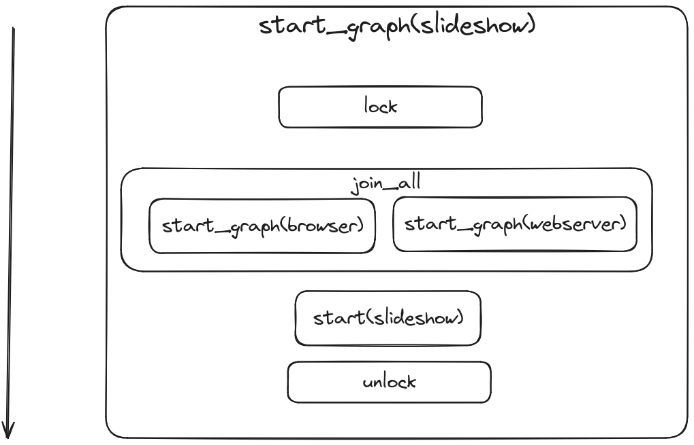

???
Let's think about the order of work.

---
class: center, middle

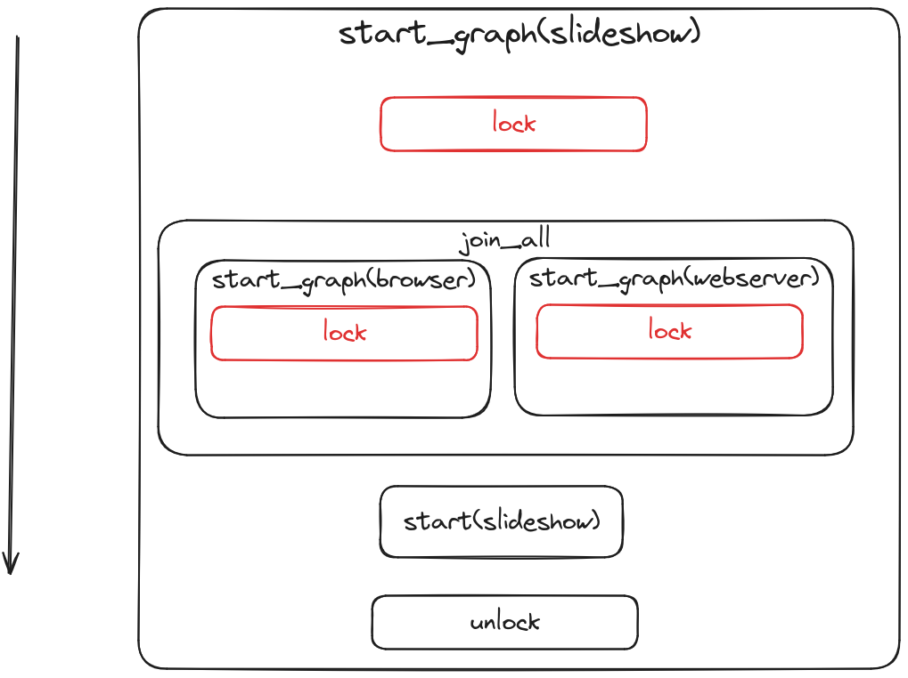

???
It becomes obvious what the problem is.

---

```rust
async fn start_graph(units: Vec<UnitDef>, 
                    mut_started_units: Arc<Mutex<Vec<String>>>, 
					name: String) {
    let mut started_units = mut_started_units.lock().await;

    if !started_units.contains(&name) {
    	started_units.push(name);
	    drop(started_units);
		...
    }
}
```
???

There's a really easy solution for this, but I want to make sure we explore both camps.

---
class: center, middle
# Concepts

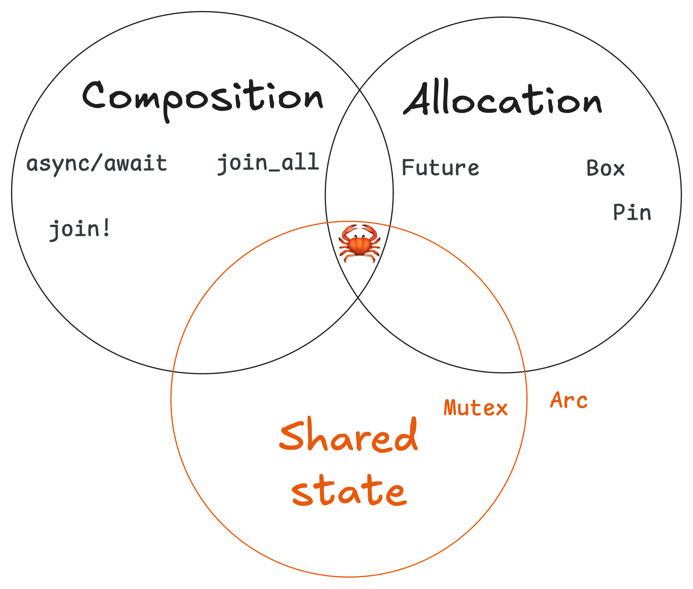

---
class: aim-start-a-graph
# Aim: Start a graph of units

 - Start the slideshow graph. 🦀
   - Use `async`, `await` and `join`.
   - Compose units of work.
 - Start an arbitrary graph. 🦀
   - Units are implementations of future.
   - Futures are datastructures.
   - `Box` to put them on the heap.
   - `Pin` to prevent them moving in memory.
   - `Mutex` to lock state.
   - `Arc` to count references at runtime.
   - Beware of deadlocks.

---

class: center, middle

# Don't share state
## Actors

???

How can we do this without sharing state?

Through actors.

An actor is something that has its own internal state, that no other actor can inspect.
 - It can send messages to other actors.
 - It can receive messages.
 
But it never has synchronous conversations. It's always async.

You might send it a message and expect a reply, but that reply will come back to you sometime in the future.


You can think of an actor in rust as implemented as a looping future that awaits messages.

Actors waits for messages via channels.

---

### Creation

```rust
let (sender, receiver) = mpsc::channel(inbox_size);

```

### Send a message

```rust
sender.send(message).await
```

### Receive a message
```rust
receiver.next().await
```

???

A channel is a mechanism for sending or receiving messages.

It's split into two parts: the sending and the receiving.

And these parts can be owned by two different things. In this case different actors.

An actor takes hold of the receiver, the inbox, and loops through it to wait for the next message.

You can send a message to the actor using the sending half of the channel.

These are mpsc - multiple producer single consumer - are perfect for actor systems. Many things can send messages, as we'll see, but only one actor can receive those.

---
class: center, middle
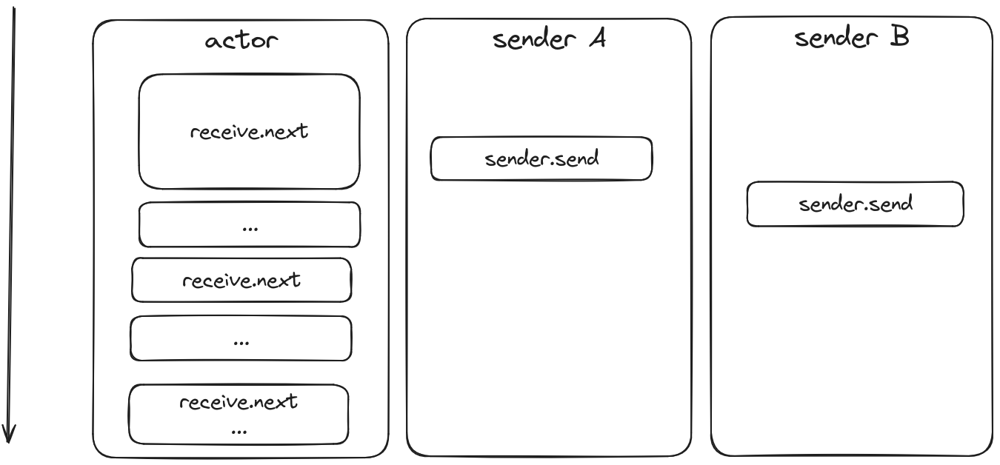
---

# The system

```rust
async fn orchestrator(...) // Orchestrator actor

async fn start_graph(...) // Unit actors
```

```rust
enum Message {
    name: String
}
```

???

In our system, we're going to have one actor - an orchestrator - that owns the state of started units. 
 - And an actor for each unit.

There's only going to be one type of message:
 - The units ask the orchestrator whether they should start.

I've used the term ask here, which is a bit dangerous in actor systems.

---

# Orchestrator

```rust
async fn orchestrator(mut inbox: mpsc::Receiver<Message>) {
    let mut started_units = Vec::new();
    while let Some(Message { name }) = inbox.next().await {
        if started_units.contains(&name) {
            unimplemented!("Unit has already started");
        } else {
            started_units.push(name);
            unimplemented!("Should start unit");
        }
    }
}
```

---

```rust
async fn start_graph(
    units: Vec<UnitDef>,
    mut orchestrator_addr: mpsc::Sender<Message>,
    name: String,
) {
    orchestrator_addr.send(Message { name }).await;
    unimplemented!("Should we start?")
}
```

???

There's a missing piece here which is the reply.

We're going to use a oneshot channel for that.

---

# Oneshot channels

```rust
let (address, inbox) = oneshot::channel::<bool>();
```

???

You can send at most one message down it.

It's perfect for situations like this, where we expect a single reply.

We're going to create a oneshot channel and send the sending half of it, the address, along with our message.

And then we're going to wait on the receiving end.

---

```rust
enum Message {
    name: String,
    unit_addr: oneshot::Sender<bool>,
}
```
---

```rust
#[async_recursion]
async fn start_graph(
  units: Vec<UnitDef>, 
  mut orchestrator_addr: mpsc::Sender<Message>,
  name: String) {
    let (unit_addr, unit_inbox) = oneshot::channel::<bool>();
    orchestrator_addr
        .send(Message {
		    name,
            unit_addr,
        })
        .await;

    if unit_inbox.await {
        let unit = find_unit(units, name);
        let start_deps = unit.dependencies.iter()
		  .map(|dep| start_graph(units, 
		                         orchestrator_addr, 
								 dep));
        join_all(start_deps).await;
        start(unit.name).await;
    }
}
```

---

```rust
async fn orchestrator(mut inbox: mpsc::Receiver<Message>) {
    let mut started_units = Vec::new();
    while let Some(Message { name, unit_addr }) = 
	  inbox.next().await {
        if started_units.contains(name) {
            unit_addr.send(false).await;
        } else {
            started_units.push(name);
            unit_addr.send(true).await;
        }
    }
}
```

???

TODO: We don't need an enum

---

```rust
fn main() {
    let units = vec![...];
    let (orchestrator_addr, 
	     orchestrator_inbox) = mpsc::channel(bound);
    let orchestrator = orchestrator(orchestrator_inbox);
    join!(orchestrator, start_graph(units, 
	                                orchestrator_addr, 
									"slideshow"))
}
```
---
class: center, middle
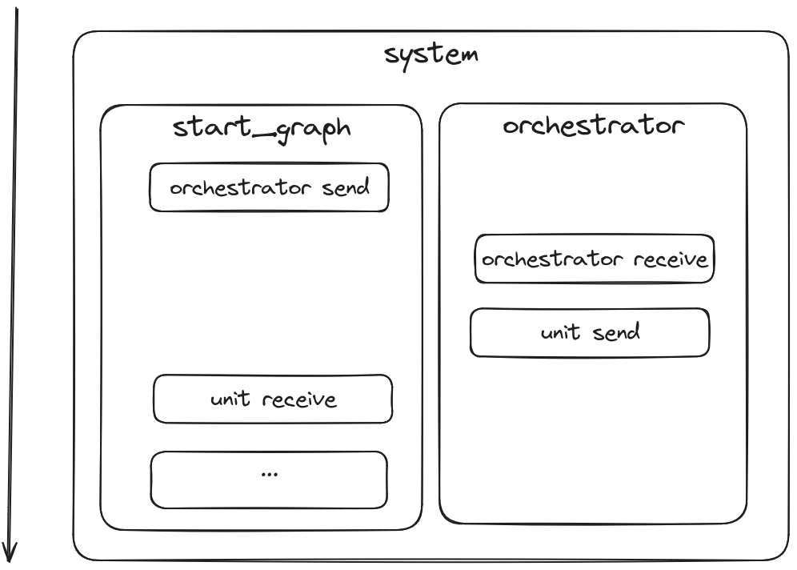

---
class: center, middle
# Concepts


---

class: center, middle


???

Channels come from Go.

---
class: aim-start-a-graph
# Aim: Start a graph of units

 - Start the slideshow graph. 🦀
   - Use `async`, `await` and `join`.
   - Compose units of work.
 - Start an arbitrary graph. 🦀
   - Units are implementations of future.
   - Futures are datastructures.
   - `Box` to put them on the heap.
   - `Pin` to prevent them moving in memory.
   - `Mutex` to lock state.
   - `Arc` to count references at runtime.
   - Beware of deadlocks.
   - Message passing with channels.
   - Looping futures as actors.
   
???
---
class: output
# The output 🎉

```sh
Starting login
Running login
Starting browser
Starting webserver
Running browser
Running webserver
Starting slideshow
Running slideshow
```

---
class: center, middle


???
We've had a whirlwind tour of async Rust.
 
 - We've looked at async / await syntax, futures, channels and shared state,

 - Whirlwind tour of async Rust
 - Understood async Rust is an idea - the idea of describing concurrent programs.
   - We've also looked under the hood and seen futures as program descriptions.
 - There's a ton that we haven't looked at:
   - We haven't looked at how the futrues are executed, select, fuse, streams.
   - Error handling
   - Cancellation
   - Both of which have different semantics in other langauges.
   - select / race.
 - We haven't explored the land of OS threads at all.

???
---
class: middle

# Async Rust

 - Concurrency is a challenge
 - Async programming borrows from many languages
 - Shared mutable state is difficult

---

class: middle
# Places to go
 - https://rust-lang.github.io/async-book/
 - https://github.com/async-rs/
 - https://tokio.rs/
 - https://without.boats/blog/

---
class:  middle

# Thank you!

- LinkedIn: zainab-ali-fp
- zainab@pureasync.com

https://zainab-ali.github.io/reasoning-with-async-rust
