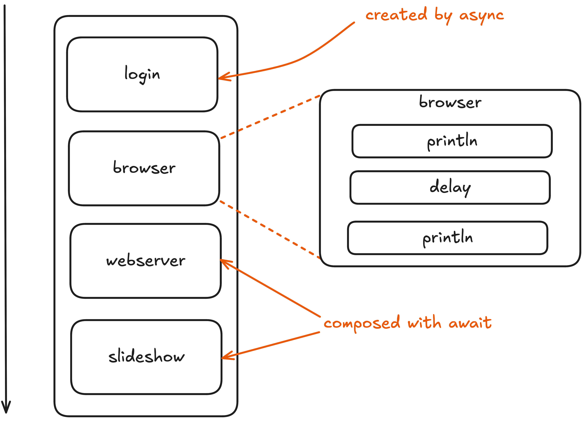
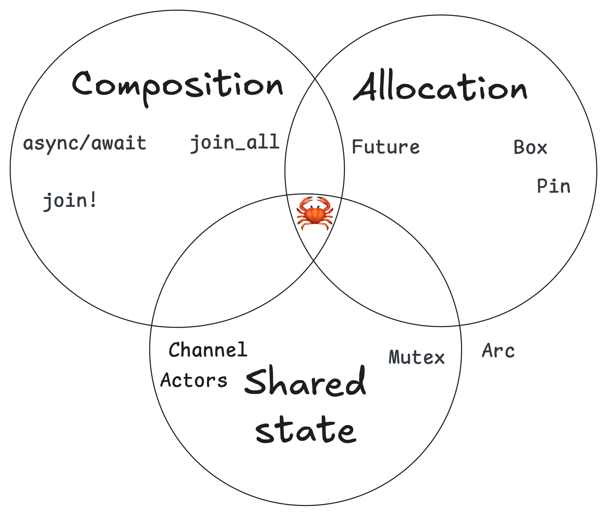

class: center, middle

# The Currents of Concurrency
## Reasoning with Async Rust
## Zainab Ali
https://zainab-ali.github.io/reasoning-with-async-rust

---

class: center, middle


---

class: center, middle


---
class: center, middle

# Concurrency

---
class: center, middle


---
class: center, middle
# Concepts


---
class: center, middle

# An example: this slideshow


---
class: aim-start-a-graph
# Aim: Start a graph of units

 - Start the slideshow graph.
 - Start an arbitrary graph.

---
## Basic Rust

```rust
fn main() {
    start("login");
    start("browser");
    start("webserver");
    start("slideshow");
}
```

```rust
fn start(name: String) {
    println!("Starting {}", name);
    sleep(one_second);
    println!("Running {}", name);
}
```

---
class: output
## The output

```sh
Starting login
Running login
Starting browser
Running browser
Starting webserver
Running webserver
Starting slideshow
Running slideshow
```

---

class: async

# Async

```rust
async fn main() {
    start("login").await;
    start("browser").await;
    start("webserver").await;
    start("slideshow").await;
}
```

```rust
async fn start(name: String) {
    println!("Starting {}", name);
    Delay::new(one_second).await;
    println!("Running {}", name);
}
```

---
class: output

# The output

```sh
Starting login
Running login
Starting browser
Running browser
Starting webserver
Running webserver
Starting slideshow
Running slideshow
```

---
class: center, middle


---
class: join
# join!

```rust
    start("browser").await;
    start("webserver").await;
```
```rust
    join!(start("browser"), start("webserver"));
```


---
class: concurrency-join

# join!

```rust
async fn main() {
    start("login").await;
    join!(start("browser"), start("webserver"));
    start("slideshow").await;
}
```

```sh
Starting login
Running login
Starting browser
Starting webserver
Running browser
Running webserver
Starting slideshow
Running slideshow
```

---
class: center, middle
# Concepts


---
class: center, middle


---

class: aim-start-a-graph
# Aim: Start a graph of units

 - Start the slideshow graph. 🦀
   - Use `async`, `await` and `join`.
   - Compose units of work.
 - Start an arbitrary graph. 🛠

---

```rust
struct UnitDef {
    name: String,
    dependencies: Vec<String>,
}

```

```rust
async fn start_graph(units: Vec<UnitDef>, name: String) -> ()
```

---

```rust
    let units = [
        UnitDef {
            name: "login",
            dependencies: vec![],
        },
        UnitDef {
            name: "browser",
            dependencies: vec!["login"],
        },
        UnitDef {
            name: "webserver",
            dependencies: vec!["login"],
        },
        UnitDef {
            name: "slideshow",
            dependencies: vec!["browser", "webserver"],
        },
    ];

```
```rust
start_graph(units, "slideshow").await;
```

---
class: center, middle


---

# Arbitrary graph

```rust
async fn start_graph(units: Vec<UnitDef>, name: String) {
    let unit = find_unit(units, name);
    unit.dependencies
	    .iter().for_each(|dep| {
            unimplemented!("start dependency");
    });
    start(unit.name).await;
}
```

---
class: center, middle

# What is `async fn`?

---

# Syntax

```rust
async fn start(name: String) {
    println!("Starting {}", name);
    Delay::new(one_second).await;
    println!("Running {}", name);
}
```

```rust
fn start(name: String) -> impl Future<Output = ()> {
    lazy(|_| println!("Starting {}", name))
        .then(|_| Delay::new(one_second))
        .then(|_| lazy(|_| println!("Running {}", name)))
}
```

---
# Arbitrary graph

```rust
async fn start_graph(units: Vec<UnitDef>, name: String) {
    let unit = find_unit(units, name);
    let start_deps = unit.dependencies.iter().map(|dep| {
	    start(dep)
    });
	join_all(start_deps).await;
    start(unit.name).await;
}
```

---
class: center, middle
# Concepts


---
class: aim-start-a-graph
# Aim: Start a graph of units

 - Start the slideshow graph. 🦀
   - Use `async`, `await` and `join`.
   - Compose units of work.
 - Start an arbitrary graph. 🦀
   - Units are implementations of future.
   - Futures are datastructures.

---
class: output
# The output

```sh
Starting browser
Starting webserver
Running browser
Running webserver
Starting slideshow
Running slideshow
```

---

# Dependencies of dependencies

```rust
async fn start_graph(units: Vec<UnitDef>, name: String) {
    let unit = find_unit(units, name);
    let start_deps = unit.dependencies.iter().map(|dep| {
	    start(dep) // <- start their dependencies too
    });
	join_all(start_deps).await;
    start(unit.name).await;
}
```

---
# Dependencies of dependencies

```rust
async fn start_graph(units: Vec<UnitDef>, name: String) {
    let unit = find_unit(units, name);
    let start_deps = unit.dependencies.iter().map(|dep| {
	    start_graph(units, dep)
    });
	join_all(start_deps).await;
    start(unit.name).await;
}
```
---

```sh
// 27 | async fn start_graph(units: Vec<UnitDef>, 
//                 name: String) {
// |             ^ recursive `async fn`
// |
// = note: a recursive `async fn` must be rewritten to
//         return a boxed `dyn Future`
// = note: consider using the `async_recursion` crate:
//         https://crates.io/crates/async_recursion
```

---

# Structs and sizes

```rust
async fn start_graph(units: Vec<UnitDef>, name: String) { }
```

```rust
fn start_graph(units: Vec<UnitDef>, 
               name: String) -> impl Future<...> { }
```

---

class: center, middle


---

# Boxing

```rust
fn start_graph(units: Vec<UnitDef>, 
               name: String) -> impl Future<...> { }
```

```rust
fn start_graph(units: Vec<UnitDef>, 
               name: String) -> Box<dyn Future<...>> { }
```

```rust
fn start_graph(units: Vec<UnitDef>, 
               name: String
			   ) -> Box<dyn Future<Output = ()>> {
    Box::new(async {
	    ...
        join_all(start_deps).await;
        start(unit.name).await;
    })
}
```

---

# Pinning

```sh
 | join_all(deps).await;
 |  -^^^^^^ the trait `Unpin` is not implemented for
 | `dyn futures::Future<Output = ()>`
```

---

# Pinning

```rust
fn start_graph(units: Vec<UnitDef>, 
               name: String
			   ) -> Pin<Box<dyn Future<Output = ()>>> {
    Box::pin(async {
	    ...
        join_all(start_deps).await;
        start(unit.name).await;
    })
}
```

---

# Async recursion

```rust
#[async_recursion]
async fn start_graph(units: Vec<UnitDef>, name: String) {
    let unit = find_unit(units, name);
    let start_deps = unit.dependencies.iter()
	  .map(|dep| start_graph(units, dep));
    join_all(start_deps).await;
    start(unit.name).await;
}
```

---
class: center, middle
# Concepts


---
class: center, middle


---
class: aim-start-a-graph
# Aim: Start a graph of units

 - Start the slideshow graph. 🦀
   - Use `async`, `await` and `join`.
   - Compose units of work.
 - Start an arbitrary graph. 🦀
   - Units are implementations of future.
   - Futures are datastructures.
   - `Box` to put them on the heap.
   - `Pin` to prevent them moving in memory.

---
class: output login-twice
# The output

```sh
Starting login
Starting login
Running login
Starting browser
Running login
Starting webserver
Running browser
Running webserver
Starting slideshow
Running slideshow
```

---

# Mutable state

```rust
#[async_recursion]
async fn start_graph(units: Vec<UnitDef>, 
    started_units: &mut Vec<String>,
	name: String) {
    if !started_units.contains(&name) {
        let unit = find_unit(units, name);
        let start_deps = unit
            .dependencies
			.iter()
            .map(|dep| start_graph(units, 
			                       started_units,
								   dep));
        join_all(start_deps).await;
        start(unit.name).await;
        started_units.push(name);
    }
}
```

---

```sh
// error: captured variable cannot escape `FnMut` closure
//    |   body
//    |         inferred to be a `FnMut` closure
```

---
class: center, middle

# The warring states


---
class: center, middle

# Shared state
## Mutex

---
class: center, middle


---

# Shared state

```rust
async fn start_graph(
   units: Vec<UnitDef>, 
   mut_started_units: Arc<Mutex<Vec<String>>>, 
   name: String) {
    let mut started_units = mut_started_units.lock().await;

    if !started_units.contains(&name) {
	    ...
        start(unit.name).await;
        started_units.push(name);
    }
}
```

---

# Output

```sh


```
---
# Shared state

```rust
async fn start_graph(
   units: Vec<UnitDef>, 
   mut_started_units: Arc<Mutex<Vec<String>>>, 
   name: String) {
    println!("About to acquire lock for {}", name);
    let mut started_units = mut_started_units.lock().await;
    println!("Acquired lock for {}", name);
    ...
}
```

```sh
About to acquire lock for slideshow
Acquired lock for slideshow
About to acquire lock for browser
About to acquire lock for webserver
```

---
class: center, middle


---
class: center, middle


 
---

```rust
async fn start_graph(
   units: Vec<UnitDef>, 
   mut_started_units: Arc<Mutex<Vec<String>>>, 
   name: String) {
    let mut started_units = mut_started_units.lock().await;

    if !started_units.contains(&name) {
    	started_units.push(name);
	    drop(started_units); // <- unlock
		... 
    }
}
```

---
class: center, middle
# Concepts


---
class: aim-start-a-graph
# Aim: Start a graph of units

 - Start the slideshow graph. 🦀
   - Use `async`, `await` and `join`.
   - Compose units of work.
 - Start an arbitrary graph. 🦀
   - Units are implementations of future.
   - Futures are datastructures.
   - `Box` to put them on the heap.
   - `Pin` to prevent them moving in memory.
   - `Mutex` to lock state.
   - `Arc` to count references at runtime.
   - Beware of deadlocks.

---

class: center, middle

# Don't share state
## Actors

---

### Creation

```rust
let (sender, receiver) = mpsc::channel(inbox_size);

```

### Send a message

```rust
sender.send(message).await
```

### Receive a message
```rust
receiver.next().await
```

---
class: center, middle

---

# The system

```rust
async fn orchestrator(...) // Orchestrator actor

async fn start_graph(...) // Unit actors
```

```rust
enum Message {
    name: String
}
```

---

# Orchestrator

```rust
async fn orchestrator(mut inbox: mpsc::Receiver<Message>) {
    let mut started_units = Vec::new();
    while let Some(Message { name }) = inbox.next().await {
        if started_units.contains(&name) {
            unimplemented!("Unit has already started");
        } else {
            started_units.push(name);
            unimplemented!("Should start unit");
        }
    }
}
```

---

```rust
async fn start_graph(
    units: Vec<UnitDef>,
    mut orchestrator_addr: mpsc::Sender<Message>,
    name: String,
) {
    orchestrator_addr.send(Message { name }).await;
    unimplemented!("Should we start?")
}
```

---

# Oneshot channels

```rust
let (address, inbox) = oneshot::channel::<bool>();
```

---

```rust
enum Message {
    name: String,
    unit_addr: oneshot::Sender<bool>,
}
```
---

```rust
#[async_recursion]
async fn start_graph(
  units: Vec<UnitDef>, 
  mut orchestrator_addr: mpsc::Sender<Message>,
  name: String) {
    let (unit_addr, unit_inbox) = oneshot::channel::<bool>();
    orchestrator_addr
        .send(Message {
		    name,
            unit_addr,
        })
        .await;

    if unit_inbox.await {
        let unit = find_unit(units, name);
        let start_deps = unit.dependencies.iter()
		  .map(|dep| start_graph(units, 
		                         orchestrator_addr, 
								 dep));
        join_all(start_deps).await;
        start(unit.name).await;
    }
}
```

---

```rust
async fn orchestrator(mut inbox: mpsc::Receiver<Message>) {
    let mut started_units = Vec::new();
    while let Some(Message { name, unit_addr }) = 
	  inbox.next().await {
        if started_units.contains(name) {
            unit_addr.send(false).await;
        } else {
            started_units.push(name);
            unit_addr.send(true).await;
        }
    }
}
```

---

```rust
fn main() {
    let units = vec![...];
    let (orchestrator_addr, 
	     orchestrator_inbox) = mpsc::channel(bound);
    let orchestrator = orchestrator(orchestrator_inbox);
    join!(orchestrator, start_graph(units, 
	                                orchestrator_addr, 
									"slideshow"))
}
```
---
class: center, middle


---
class: center, middle
# Concepts


---

class: center, middle


---
class: aim-start-a-graph
# Aim: Start a graph of units

 - Start the slideshow graph. 🦀
   - Use `async`, `await` and `join`.
   - Compose units of work.
 - Start an arbitrary graph. 🦀
   - Units are implementations of future.
   - Futures are datastructures.
   - `Box` to put them on the heap.
   - `Pin` to prevent them moving in memory.
   - `Mutex` to lock state.
   - `Arc` to count references at runtime.
   - Beware of deadlocks.
   - Message passing with channels.
   - Looping futures as actors.
   
---
class: output
# The output 🎉

```sh
Starting login
Running login
Starting browser
Starting webserver
Running browser
Running webserver
Starting slideshow
Running slideshow
```

---
class: center, middle


---
class: center, middle
# Concepts



---

class: middle
# Places to go
 - https://rust-lang.github.io/async-book/
 - https://tokio.rs/
 - https://github.com/async-rs/
 - https://without.boats/blog/

---
class:  middle

# Thank you!

- LinkedIn: zainab-ali-fp
- zainab@pureasync.com

https://zainab-ali.github.io/reasoning-with-async-rust

